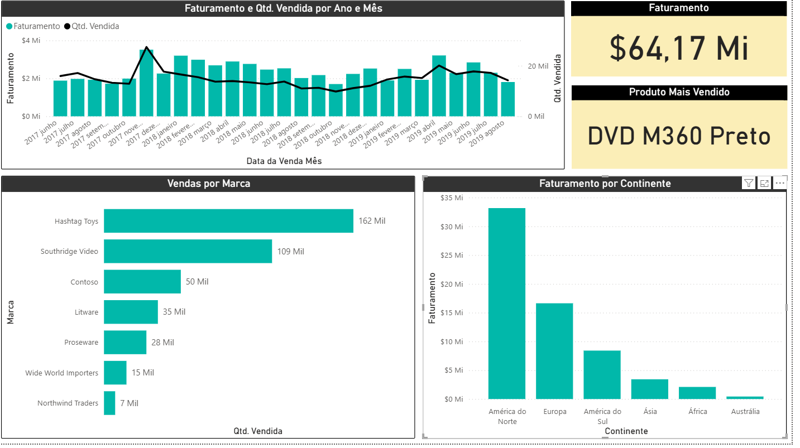
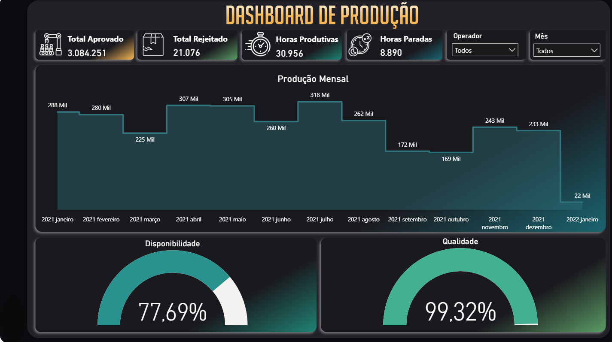
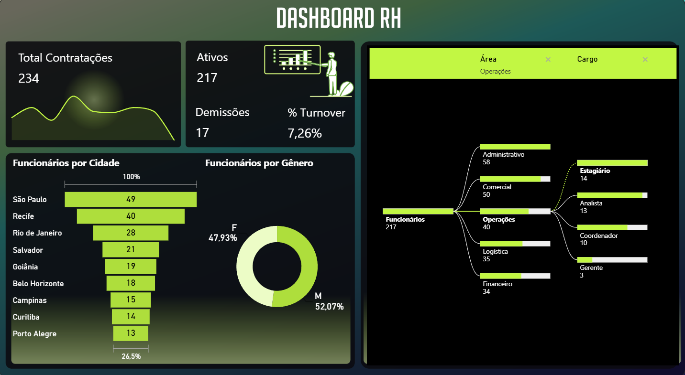
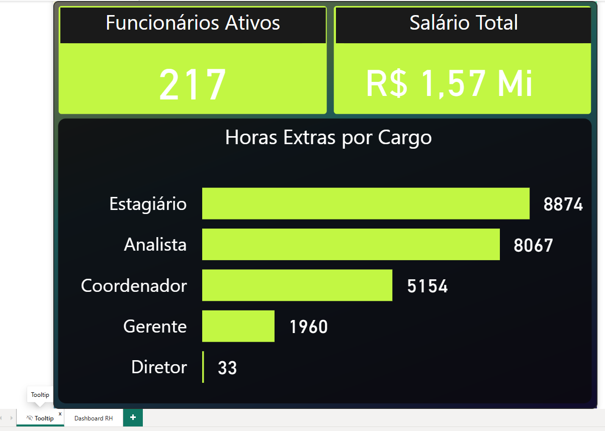

<div align="center">

# 📊 Enzo Galdino Amorielo

### Analista de Dados Jr | Python, SQL, Power BI | Ex-iFood & NielsenIQ

📍 Taboão da Serra, São Paulo, Brasil


[](https://www.linkedin.com/in/enzo-galdino-amorielo-100240274/)
[](mailto:enzoamorielo8@gmail.com)

</div>

---

## 👋 Sobre mim

Sou **Analista de Dados Júnior**, com passagem por **iFood** e **NielsenIQ**, e transformo dados em indicadores confiáveis para apoiar decisões de negócio. Trabalho com **Power BI, Python e SQL**, e neste portfólio mostro projetos de áreas diferentes: **Comercial, Produção e Recursos Humanos**.

Meu fluxo de trabalho cobre o ciclo completo de analytics: **entender o problema de negócio → organizar e modelar os dados → construir métricas (DAX/SQL) → extrair insights → comunicar com dashboards claros**.

> 📌 **Sobre os projetos:** os projetos de **Power BI** são estudos de caso / projetos de portfólio desenvolvidos com bases de dados de portfólio, sem informações confidenciais de empresas. Os projetos de **Python** e **SQL** são estudos de caso **simulados**, com dados sintéticos gerados por script. Todos servem para demonstrar repertório técnico e raciocínio analítico na resolução de problemas de negócio.

---

## 🧰 Habilidades Técnicas

| Categoria | Tecnologias e Competências |
|---|---|
| **BI & Dataviz** | Power BI Desktop, DAX, Power Query, modelagem dimensional (Star Schema), storytelling com dados, design de dashboards, tooltips e visuais customizados |
| **Data Analysis & Code** | Python (Pandas, NumPy, Matplotlib, Seaborn, Scikit-Learn), Análise Exploratória (EDA), estatística descritiva e inferencial, engenharia de features, modelos baseline de classificação |
| **Banco de Dados** | PostgreSQL, BigQuery, SQL avançado (CTEs, Window Functions, agregações complexas), modelagem de Data Warehouse, otimização de consultas |
| **Metodologias** | Indicadores operacionais e de negócio (disponibilidade, qualidade, MTBF, MTTR, turnover, Pareto), versionamento com Git/GitHub, documentação técnica |

---

## 🗂️ Índice dos Projetos

| # | Projeto | Ferramentas | Tipo |
|---|---|---|---|
| 1 | [Relatório de Vendas](#-projeto-1--relatório-de-vendas-power-bi) | Power BI | Dashboard |
| 2 | [Dashboard de Produção e Eficiência Operacional](#-projeto-2--dashboard-de-produção-e-eficiência-operacional-power-bi) | Power BI, DAX | Dashboard |
| 3 | [Dashboard de RH e Turnover](#-projeto-3--dashboard-de-rh-e-turnover-power-bi) | Power BI, DAX, visuais customizados | Dashboard |
| 4 | [Manutenção Preditiva com Python](#-projeto-4--manutenção-preditiva-e-previsão-de-falhas-python) | Python, Scikit-Learn | EDA + ML |
| 5 | [Data Warehouse e SQL Avançado](#-projeto-5--data-warehouse-e-queries-de-produtividade-sql) | PostgreSQL / BigQuery | SQL |


---

# 🟡 Projetos em Power BI

Três projetos de portfólio construídos no Power BI Desktop, cobrindo áreas diferentes de uma empresa (**Comercial, Produção e Recursos Humanos**). Em cada um, parto de uma pergunta de negócio, organizo a base, crio as métricas e desenho um dashboard orientado à decisão.

| Projeto | Área | Base de dados | Principais recursos |
|---|---|---|---|
| [1. Relatório de Vendas](#-projeto-1--relatório-de-vendas-power-bi) | Comercial | `Base Vendas` | Gráfico combinado, mapa, cartões, filtro Top N |
| [2. Dashboard de Produção (Global)](#-projeto-2--dashboard-de-produção-e-eficiência-operacional-power-bi) | Indústria / Operações | `BaseProdução` + tabela `Medidas` | Medidas DAX, medidores (gauge), segmentações, identidade visual |
| [3. Dashboard de RH](#-projeto-3--dashboard-de-rh-e-turnover-power-bi) | Pessoas | `BaseFuncionarios` | Tooltip personalizado, visuais customizados, árvore de decomposição |

---

## 📌 Projeto 1 — Relatório de Vendas (Power BI)

> **Tipo:** Estudo de Caso / Projeto de Portfólio · **Área:** Comercial · **Ferramentas:** Power BI Desktop

### 🎯 Problema de Negócio

A área comercial precisa de uma visão única de **quanto está vendendo, de quais marcas e produtos, em quais regiões do mundo e como isso evolui no tempo**. Sem esse painel, a análise depende de consultas manuais na base, o que atrasa a identificação de marcas de destaque e de mercados com potencial.

**Perguntas que o dashboard responde:**

1. Qual o faturamento total e qual o produto mais vendido?
2. Quais marcas concentram o maior volume de vendas?
3. Como faturamento e quantidade vendida evoluem ao longo dos anos e meses?
4. Quais continentes geram mais faturamento?

### 🛠️ Solução Desenvolvida

- Importação e tratamento da tabela `Base Vendas` (marca, produto, continente, data da venda, quantidade vendida e faturamento).
- Uso da **hierarquia de datas** (Ano → Mês) para navegar na evolução temporal.
- **Cartão do produto mais vendido** construído com filtro **Top N** sobre a quantidade vendida.
- Dashboard de uma página, com layout limpo e tema personalizado.

### 📈 Principais Métricas

| Métrica | Descrição |
|---|---|
| **Faturamento** | Soma do faturamento das vendas |
| **Quantidade Vendida** | Soma das unidades vendidas |
| **Produto Mais Vendido** | Produto com maior quantidade vendida (filtro Top 1) |
| **Vendas por Marca** | Quantidade vendida agrupada por marca |
| **Faturamento por Continente** | Distribuição geográfica do faturamento |

### 📊 Visualizações Utilizadas

| Visual | Campos | Objetivo |
|---|---|---|
| Cartão: **Faturamento** | Soma de Faturamento | KPI principal |
| Cartão: **Produto Mais Vendido** | Produto + filtro Top N por Qtd. Vendida | Destaque do campeão de vendas |
| Gráfico de barras: **Vendas por Marca** | Marca × Soma de Qtd. Vendida | Ranking de marcas |
| Gráfico de colunas e linhas | Ano/Mês × Faturamento (colunas) e Qtd. Vendida (linha) | Evolução temporal e relação entre receita e volume |
| Mapa (Azure Maps) | Continente × Faturamento (tamanho da bolha) | Visão geográfica |

### 🧮 Medidas / Agregações

Este projeto usa principalmente agregações simples. Abaixo, as medidas DAX equivalentes:

<!-- CONFERIR: ajuste os nomes de tabela/colunas conforme o modelo do seu .pbix -->
```dax
Faturamento =
SUM ( 'Base Vendas'[Faturamento] )

Qtd Vendida =
SUM ( 'Base Vendas'[Qtd. Vendida] )

// Ticket médio por unidade vendida
Preço Médio =
DIVIDE ( [Faturamento], [Qtd Vendida] )

// Produto mais vendido (equivalente ao filtro Top 1 usado no cartão)
Produto Mais Vendido =
VAR _Tabela =
    ADDCOLUMNS (
        VALUES ( 'Base Vendas'[Produto] ),
        "@Qtd", CALCULATE ( SUM ( 'Base Vendas'[Qtd. Vendida] ) )
    )
RETURN
    MAXX ( TOPN ( 1, _Tabela, [@Qtd], DESC ), 'Base Vendas'[Produto] )
```

### 🖼️ Prévia do Dashboard

<!-- Para exibir a imagem: suba o print em assets/img e apague a linha de abertura e a linha de fechamento do comentario logo abaixo. -->
<!--

-->

---

## 📌 Projeto 2 — Dashboard de Produção e Eficiência Operacional (Power BI)

> **Tipo:** Estudo de Caso / Projeto de Portfólio · **Área:** Indústria / Operações · **Ferramentas:** Power BI Desktop, DAX

### 🎯 Problema de Negócio

A gestão da produção precisa acompanhar, em um só lugar, **quanto foi produzido, quanto foi aprovado e rejeitado, quantas horas as máquinas ficaram produzindo e quantas ficaram paradas**. Sem isso, não é possível quantificar perdas de **disponibilidade** (tempo) e de **qualidade** (peças rejeitadas), nem comparar o desempenho entre operadores e períodos.

**Perguntas que o dashboard responde:**

1. Qual o volume produzido por mês e como ele evolui?
2. Qual a proporção entre **Horas Produtivas** e **Horas Paradas**?
3. Qual a **Disponibilidade** e a **Qualidade** da operação?
4. Há diferença de desempenho entre operadores ou entre meses?

### 🛠️ Solução Desenvolvida

- Tabela `BaseProdução` com quantidade aprovada, total rejeitado, horas produtivas, horas paradas, operador e data de início.
- Tabela dedicada `Medidas`, mantendo o modelo organizado e separando cálculos dos dados.
- Indicadores principais em **cartões com ícones personalizados** (Horas Produtivas, Horas Paradas, Produzido, Rejeitado).
- **Medidores (gauge)** para Disponibilidade e Qualidade, com cores distintas por indicador.
- **Segmentações** por Operador e por Mês para análise interativa.
- Identidade visual própria: plano de fundo e ícones desenhados para o relatório.

### 📈 Principais Métricas

| Métrica | Descrição |
|---|---|
| **Horas Produtivas** | Tempo em que a produção esteve em operação |
| **Horas Paradas** | Tempo de parada de máquina (downtime) |
| **Quantidade Aprovada** | Peças aprovadas na inspeção |
| **Total Rejeitado** | Peças rejeitadas / refugo |
| **Qtd Produzida** | Volume total produzido (medida DAX) |
| **Disponibilidade** | Horas produtivas em relação ao tempo total (medida DAX) |
| **Qualidade** | Proporção de peças aprovadas sobre o total produzido (medida DAX) |

### 📊 Visualizações Utilizadas

| Visual | Campos | Objetivo |
|---|---|---|
| Cartões com ícone | Horas Produtivas, Horas Paradas, Quant. Aprovada, Total Rejeitado | KPIs de produção e perdas |
| Gráfico de área: **Produção Mensal** | Ano/Mês × Qtd Produzida | Tendência de volume |
| Medidor: **Disponibilidade** | Medida Disponibilidade | Eficiência de tempo |
| Medidor: **Qualidade** | Medida Qualidade | Eficiência de qualidade |
| Segmentações | Operador e Mês | Filtros interativos |

### 🧮 Medidas DAX Utilizadas

<!-- CONFERIR: o modelo de dados do .pbix é compactado e não pôde ser lido; confirme estas expressões com as medidas reais (Qtd Produzida, Disponibilidade, Qualidade) e ajuste os nomes das colunas -->
```dax
// ---------- Medidas base ----------
Horas Produtivas =
SUM ( BaseProdução[Horas Produtivas] )

Horas Paradas =
SUM ( BaseProdução[Horas Paradas] )

Qtd Aprovada =
SUM ( BaseProdução[Quant. Aprovada] )

Qtd Rejeitada =
SUM ( BaseProdução[Total Rejeitado] )

// ---------- Volume ----------
Qtd Produzida =
[Qtd Aprovada] + [Qtd Rejeitada]

// ---------- Indicadores de eficiência ----------
Disponibilidade =
DIVIDE (
    [Horas Produtivas],
    [Horas Produtivas] + [Horas Paradas]
)

Qualidade =
DIVIDE ( [Qtd Aprovada], [Qtd Produzida] )

% de Refugo =
DIVIDE ( [Qtd Rejeitada], [Qtd Produzida] )

// ---------- Inteligência de tempo ----------
Qtd Produzida Mês Anterior =
CALCULATE ( [Qtd Produzida], DATEADD ( 'Calendário'[Data], -1, MONTH ) )

Variação MoM =
DIVIDE ( [Qtd Produzida] - [Qtd Produzida Mês Anterior], [Qtd Produzida Mês Anterior] )
```

> 💡 **Evolução natural do projeto:** com uma tabela de ocorrências de parada (motivo, início e fim), é possível calcular **MTBF** e **MTTR** e montar um Pareto de motivos. Essa modelagem está detalhada no [Projeto 5 (SQL)](#-projeto-5--data-warehouse-e-queries-de-produtividade-sql).

### 🖼️ Prévia do Dashboard

<!-- Para exibir a imagem: suba o print em assets/img e apague a linha de abertura e a linha de fechamento do comentario logo abaixo. -->
<!--

-->

---

## 📌 Projeto 3 — Dashboard de RH e Turnover (Power BI)

> **Tipo:** Estudo de Caso / Projeto de Portfólio · **Área:** Pessoas / RH · **Ferramentas:** Power BI Desktop, DAX, visuais customizados

### 🎯 Problema de Negócio

O RH precisa entender o **tamanho e o perfil do quadro de funcionários**, a **evolução de contratações e demissões** e o **turnover**, além de identificar onde se concentram **custos com salário e horas extras**. Sem um painel, indicadores como turnover e distribuição por área, cargo, gênero e cidade ficam espalhados em planilhas.

**Perguntas que o dashboard responde:**

1. Quantos funcionários estão ativos, quantas contratações e demissões ocorreram e qual o turnover?
2. Como evoluem as contratações ao longo dos anos?
3. Como o quadro se distribui por gênero, cidade, área e cargo?
4. Quanto custa a folha (salário total) e quais cargos concentram horas extras?

### 🛠️ Solução Desenvolvida

- Tabela `BaseFuncionarios` com cargo, área, cidade, gênero, salário, horas extras, ano de contratação e status.
- **Medidas DAX** para funcionários, funcionários ativos, contratações, demissões e % de turnover.
- **Duas páginas:** *Dashboard RH* (visão geral) e *Tooltip* (página de dica de ferramenta personalizada, 320×240).
- **Tooltip personalizado:** ao passar o mouse, exibe Funcionários Ativos, Salário Total e Horas Extras por Cargo.
- **Visuais customizados** importados para o gráfico de contratações anuais.
- **Árvore de decomposição** para explorar o quadro por Área e Cargo.

### 📈 Principais Métricas

| Métrica | Descrição |
|---|---|
| **Funcionários Ativos** | Quadro atual de colaboradores |
| **Contratações** | Total de admissões (por ano) |
| **Demissões** | Total de desligamentos |
| **% Turnover** | Rotatividade do quadro |
| **Salário Total** | Soma dos salários |
| **Horas Extras** | Total de horas extras por cargo |

### 📊 Visualizações Utilizadas

| Visual | Campos | Objetivo |
|---|---|---|
| Cartões | Contratações, Func. Ativos, Demissões, Turnover | KPIs de pessoas |
| Visual customizado: **Total Contratações Anual** | Ano da Contratação × Total Contratações | Evolução de admissões |
| Rosca | Gênero × Funcionários Ativos | Perfil do quadro |
| Funil | Cidade × Funcionários Ativos | Distribuição por localidade |
| Árvore de decomposição | Funcionários Ativos explicado por Área e Cargo | Análise exploratória guiada |
| Tooltip personalizado | Funcionários Ativos, Salário Total, Horas Extras por Cargo | Detalhe sob demanda |

### 🧮 Medidas DAX Utilizadas

<!-- CONFERIR: o modelo de dados do .pbix é compactado e não pôde ser lido; confirme estas expressões com as medidas reais (Funcionários, Funcionarios Ativos, Total Contratacoes, Demissoes, % Turnover) e ajuste os nomes das colunas -->
```dax
Funcionários =
COUNTROWS ( BaseFuncionarios )

Funcionarios Ativos =
CALCULATE (
    COUNTROWS ( BaseFuncionarios ),
    BaseFuncionarios[Status] = "Ativo"
)

Total Contratacoes =
COUNTROWS ( BaseFuncionarios )  -- agrupado por [Ano da Contratação] no visual

Demissoes =
CALCULATE (
    COUNTROWS ( BaseFuncionarios ),
    BaseFuncionarios[Status] = "Desligado"
)

// Turnover = média entre admissões e desligamentos sobre o quadro
% Turnover =
DIVIDE (
    ( [Total Contratacoes] + [Demissoes] ) / 2,
    [Funcionários]
)

Salário Total =
SUM ( BaseFuncionarios[Salario] )

Horas Extras Total =
SUM ( BaseFuncionarios[Horas Extras] )
```

### 🖼️ Prévia do Dashboard

<!-- Para exibir a imagem: suba o print em assets/img e apague a linha de abertura e a linha de fechamento do comentario logo abaixo. -->
<!--


-->

---

## 🧱 Modelagem de Dados (Power BI)

Nos três projetos, os relatórios foram construídos sobre **uma tabela de base por assunto**, com cálculos centralizados em medidas DAX (no projeto de Produção, em uma tabela `Medidas` dedicada).

| Projeto | Tabela principal | Observações |
|---|---|---|
| Vendas | `Base Vendas` | Hierarquia automática de datas (Ano → Mês) |
| Produção | `BaseProdução` + `Medidas` | Medidas separadas dos dados; hierarquia de datas por *Data Início* |
| RH | `BaseFuncionarios` | Visual customizado e página de tooltip |

> 📌 **Modelo dimensional completo:** a modelagem em **Star Schema**, com fatos de ordens, apontamentos, paradas e metas e suas dimensões, está demonstrada no [Projeto 5 (SQL)](#-projeto-5--data-warehouse-e-queries-de-produtividade-sql).

---

# 🐍 Projetos de Análise de Dados

## 📌 Projeto 4 — Manutenção Preditiva e Previsão de Falhas (Python)

> **Tipo:** Estudo de caso simulado · **Dados:** sintéticos gerados por script · **Ferramentas:** Python, Pandas, NumPy, Seaborn, Scikit-Learn
>
> 📂 **Código completo:** [python/manutencao-preditiva](https://github.com/EnzoAmorielo/EnzoAmorielo/tree/main/python/manutencao-preditiva)

### 🎯 Problema de Negócio (Simulado)

A indústria fictícia realiza **manutenção corretiva**: a máquina só é reparada depois que quebra, gerando paradas longas e imprevisíveis. A diretoria quer saber se é possível **antecipar falhas nas próximas 24 horas** a partir de dados de sensores, para programar intervenções preventivas e reduzir paradas não planejadas.

**Objetivo analítico:** construir um modelo baseline que classifique se uma máquina **falhará nas próximas 24h** (`falha_24h = 1`).

### 🧪 Hipóteses Testadas

| # | Hipótese | Como foi testada |
|---|---|---|
| H1 | Temperatura e vibração elevadas aumentam a probabilidade de falha | Comparação de médias entre grupos + teste de Mann-Whitney |
| H2 | Quanto mais tempo desde a última manutenção, maior o risco | Taxa de falha por faixas de horas desde a manutenção |
| H3 | Máquinas mais antigas falham mais | Boxplot e taxa de falha por idade |
| H4 | Os sinais combinados (temperatura + vibração) discriminam melhor que isolados | Importância de variáveis e AUC do modelo |

### 💻 Código do Projeto

```python
# ============================================================
# Manutenção Preditiva - Estudo de Caso Simulado
# Objetivo: prever falha de maquinário nas próximas 24h
# ============================================================
import numpy as np
import pandas as pd
import matplotlib.pyplot as plt
import seaborn as sns
from scipy.stats import mannwhitneyu

from sklearn.model_selection import train_test_split
from sklearn.preprocessing import StandardScaler
from sklearn.pipeline import Pipeline
from sklearn.linear_model import LogisticRegression
from sklearn.ensemble import RandomForestClassifier
from sklearn.metrics import (
    classification_report, confusion_matrix,
    roc_auc_score, RocCurveDisplay, PrecisionRecallDisplay
)

sns.set_theme(style="whitegrid")
RNG = np.random.default_rng(42)

# ------------------------------------------------------------
# 1. GERAÇÃO DE DADOS SINTÉTICOS (simulação de sensores)
# ------------------------------------------------------------
n = 20_000
df = pd.DataFrame({
    "temperatura_c":         RNG.normal(70, 8, n),
    "vibracao_mm_s":         RNG.gamma(shape=4, scale=1.1, size=n),
    "pressao_bar":           RNG.normal(6.0, 0.6, n),
    "ruido_db":              RNG.normal(78, 5, n),
    "carga_pct":             RNG.uniform(40, 100, n),
    "horas_desde_manutencao": RNG.uniform(0, 1500, n),
    "idade_maquina_anos":    RNG.integers(1, 21, n),
})

# Probabilidade de falha (relação logística construída para o estudo)
z = (
    -5.0
    + 0.06 * (df["temperatura_c"] - 70)
    + 0.35 * (df["vibracao_mm_s"] - 4.4)
    + 0.0016 * df["horas_desde_manutencao"]
    + 0.05 * df["idade_maquina_anos"]
    + 0.015 * (df["carga_pct"] - 70)
)
prob = 1 / (1 + np.exp(-z))
df["falha_24h"] = (RNG.random(n) < prob).astype(int)

print(f"Registros: {len(df):,} | Taxa de falha: {df['falha_24h'].mean():.2%}")

# ------------------------------------------------------------
# 2. ANÁLISE EXPLORATÓRIA (EDA)
# ------------------------------------------------------------
print(df.describe().T.round(2))

# 2.1 Desbalanceamento da variável alvo
sns.countplot(data=df, x="falha_24h")
plt.title("Distribuição da variável alvo (desbalanceada)")
plt.show()

# 2.2 Correlação entre variáveis
plt.figure(figsize=(8, 6))
sns.heatmap(df.corr(), annot=True, fmt=".2f", cmap="coolwarm", center=0)
plt.title("Matriz de correlação")
plt.show()

# 2.3 H1: temperatura e vibração por grupo
fig, axes = plt.subplots(1, 2, figsize=(11, 4))
sns.boxplot(data=df, x="falha_24h", y="temperatura_c", ax=axes[0])
sns.boxplot(data=df, x="falha_24h", y="vibracao_mm_s", ax=axes[1])
axes[0].set_title("Temperatura vs. falha")
axes[1].set_title("Vibração vs. falha")
plt.tight_layout()
plt.show()

for col in ["temperatura_c", "vibracao_mm_s"]:
    a = df.loc[df.falha_24h == 1, col]
    b = df.loc[df.falha_24h == 0, col]
    stat, p = mannwhitneyu(a, b, alternative="greater")
    print(f"H1 | {col}: média falha={a.mean():.2f} vs normal={b.mean():.2f} | p-valor={p:.2e}")

# 2.4 H2: taxa de falha por faixa de horas desde a manutenção
df["faixa_manut"] = pd.cut(
    df["horas_desde_manutencao"],
    bins=[0, 300, 600, 900, 1200, 1500],
    labels=["0-300", "300-600", "600-900", "900-1200", "1200-1500"],
    include_lowest=True,
)
taxa_manut = df.groupby("faixa_manut", observed=True)["falha_24h"].mean()
taxa_manut.plot(kind="bar", color="#F2C811")
plt.ylabel("Taxa de falha")
plt.title("H2: taxa de falha por horas desde a última manutenção")
plt.show()

# ------------------------------------------------------------
# 3. PREPARAÇÃO E MODELO BASELINE
# ------------------------------------------------------------
features = [
    "temperatura_c", "vibracao_mm_s", "pressao_bar", "ruido_db",
    "carga_pct", "horas_desde_manutencao", "idade_maquina_anos",
]
X = df[features]
y = df["falha_24h"]

# Estratificação mantém a proporção da classe rara em treino e teste
X_train, X_test, y_train, y_test = train_test_split(
    X, y, test_size=0.25, stratify=y, random_state=42
)

modelos = {
    "Regressão Logística": Pipeline([
        ("scaler", StandardScaler()),
        ("clf", LogisticRegression(class_weight="balanced", max_iter=1000)),
    ]),
    "Random Forest": RandomForestClassifier(
        n_estimators=300, max_depth=8, min_samples_leaf=20,
        class_weight="balanced", n_jobs=-1, random_state=42
    ),
}

resultados = {}
for nome, modelo in modelos.items():
    modelo.fit(X_train, y_train)
    proba = modelo.predict_proba(X_test)[:, 1]
    resultados[nome] = (modelo, proba)
    print(f"\n=== {nome} | ROC-AUC: {roc_auc_score(y_test, proba):.3f} ===")
    print(classification_report(y_test, modelo.predict(X_test), digits=3))

# ------------------------------------------------------------
# 4. AVALIAÇÃO
# ------------------------------------------------------------
fig, axes = plt.subplots(1, 2, figsize=(12, 4.5))
for nome, (_, proba) in resultados.items():
    RocCurveDisplay.from_predictions(y_test, proba, name=nome, ax=axes[0])
    PrecisionRecallDisplay.from_predictions(y_test, proba, name=nome, ax=axes[1])
axes[0].set_title("Curva ROC")
axes[1].set_title("Curva Precisão-Recall")
plt.tight_layout()
plt.show()

# Matriz de confusão do Random Forest
rf = resultados["Random Forest"][0]
sns.heatmap(confusion_matrix(y_test, rf.predict(X_test)),
            annot=True, fmt="d", cmap="Blues")
plt.xlabel("Previsto"); plt.ylabel("Real")
plt.title("Matriz de confusão - Random Forest")
plt.show()

# Importância das variáveis (H4)
imp = pd.Series(rf.feature_importances_, index=features).sort_values()
imp.plot(kind="barh", color="#0078D4")
plt.title("Importância das variáveis - Random Forest")
plt.show()

# ------------------------------------------------------------
# 5. AJUSTE DE LIMIAR (decisão de negócio)
# ------------------------------------------------------------
# Em manutenção, perder uma falha (falso negativo) costuma custar mais
# que uma inspeção desnecessária (falso positivo). Ajustamos o limiar
# para priorizar recall.
proba_rf = resultados["Random Forest"][1]
for limiar in [0.3, 0.4, 0.5, 0.6]:
    pred = (proba_rf >= limiar).astype(int)
    tn, fp, fn, tp = confusion_matrix(y_test, pred).ravel()
    print(f"Limiar {limiar:.1f} | Recall={tp/(tp+fn):.2%} | "
          f"Precisão={tp/(tp+fp):.2%} | Inspeções geradas={tp+fp}")
```

### 📋 Insights Extraídos (Simulados)

1. **Desbalanceamento:** falhas são eventos raros, então *accuracy* é uma métrica enganosa. O foco foi em **recall, precisão, ROC-AUC e curva Precisão-Recall**.
2. **H1 confirmada:** temperatura e vibração são estatisticamente mais altas nos registros que antecedem falhas.
3. **H2 confirmada:** a taxa de falha cresce de forma consistente com as horas desde a última manutenção, o que embasa **intervalos de manutenção preventiva**.
4. **H4:** a combinação de sinais de sensores e variáveis de histórico supera o uso de sinais isolados.
5. **Decisão de negócio:** reduzir o limiar de classificação aumenta o recall (menos falhas perdidas) ao custo de mais inspeções, o que permite à gestão escolher o ponto de equilíbrio entre custo de inspeção e custo de parada.

### 🔭 Próximos Passos Sugeridos

- Validação temporal (treino no passado, teste no futuro) para evitar vazamento de dados.
- Engenharia de features em janelas móveis (média e desvio dos últimos N registros).
- Testar Gradient Boosting (XGBoost / LightGBM) e calibrar probabilidades.
- Operacionalizar o score de risco em um dashboard no Power BI.

> ⚠️ **Limitação assumida:** como os dados são sintéticos e gerados por uma relação conhecida, as métricas servem para demonstrar a **metodologia**, e não representam desempenho esperado em dados reais.

---

## 📌 Projeto 5 — Data Warehouse e Queries de Produtividade (SQL)

> **Tipo:** Estudo de caso simulado · **Ferramentas:** PostgreSQL (compatível com BigQuery com pequenos ajustes) · **Técnicas:** CTEs, Window Functions, agregações complexas
>
> 📂 **Código completo:** [sql/data-warehouse](https://github.com/EnzoAmorielo/EnzoAmorielo/tree/main/sql/data-warehouse)

### 🎯 Problema de Negócio (Simulado)

A fábrica fictícia mantém dados de produção, paradas e qualidade em sistemas separados. Foi proposto um **Data Warehouse dimensional** para centralizar as informações e responder, com SQL, perguntas críticas de produtividade.

### 🗄️ Schema do Banco (Star Schema)

```sql
-- ============================================================
-- DATA WAREHOUSE - PRODUTIVIDADE OPERACIONAL (PostgreSQL)
-- ============================================================
CREATE SCHEMA IF NOT EXISTS dw;

-- ---------- DIMENSÕES ----------
CREATE TABLE dw.dim_maquina (
    id_maquina      SERIAL PRIMARY KEY,
    nome_maquina    VARCHAR(60)  NOT NULL,
    linha           VARCHAR(30)  NOT NULL,
    setor           VARCHAR(30)  NOT NULL,
    data_instalacao DATE
);

CREATE TABLE dw.dim_turno (
    id_turno    SERIAL PRIMARY KEY,
    nome_turno  VARCHAR(20) NOT NULL,     -- Manhã, Tarde, Noite
    hora_inicio TIME NOT NULL,
    hora_fim    TIME NOT NULL
);

CREATE TABLE dw.dim_produto (
    id_produto     SERIAL PRIMARY KEY,
    nome_produto   VARCHAR(80) NOT NULL,
    familia        VARCHAR(40),
    custo_unitario NUMERIC(10,2) NOT NULL
);

CREATE TABLE dw.dim_motivo_parada (
    id_motivo   SERIAL PRIMARY KEY,
    motivo      VARCHAR(80) NOT NULL,
    categoria   VARCHAR(40) NOT NULL,       -- Mecânica, Elétrica, Logística...
    tipo_parada VARCHAR(15) NOT NULL
        CHECK (tipo_parada IN ('PLANEJADA', 'CORRETIVA'))
);

CREATE TABLE dw.dim_calendario (
    data       DATE PRIMARY KEY,
    ano        SMALLINT NOT NULL,
    mes        SMALLINT NOT NULL,
    semana     SMALLINT NOT NULL,
    dia_semana SMALLINT NOT NULL,
    dia_util   BOOLEAN  NOT NULL
);

-- ---------- FATOS ----------
CREATE TABLE dw.fato_ordem_producao (
    id_ordem       SERIAL PRIMARY KEY,
    id_produto     INT NOT NULL REFERENCES dw.dim_produto(id_produto),
    qtd_planejada  INT NOT NULL CHECK (qtd_planejada > 0),
    data_abertura  DATE NOT NULL REFERENCES dw.dim_calendario(data),
    data_prevista  DATE NOT NULL
);

CREATE TABLE dw.fato_apontamento (
    id_apontamento   BIGSERIAL PRIMARY KEY,
    id_ordem         INT NOT NULL REFERENCES dw.fato_ordem_producao(id_ordem),
    id_maquina       INT NOT NULL REFERENCES dw.dim_maquina(id_maquina),
    id_turno         INT NOT NULL REFERENCES dw.dim_turno(id_turno),
    data             DATE NOT NULL REFERENCES dw.dim_calendario(data),
    horas_produtivas NUMERIC(6,2) NOT NULL CHECK (horas_produtivas >= 0),
    qtd_produzida    INT NOT NULL CHECK (qtd_produzida >= 0),
    qtd_rejeitada    INT NOT NULL DEFAULT 0 CHECK (qtd_rejeitada >= 0)
);

CREATE TABLE dw.fato_parada (
    id_parada     BIGSERIAL PRIMARY KEY,
    id_maquina    INT NOT NULL REFERENCES dw.dim_maquina(id_maquina),
    id_turno      INT NOT NULL REFERENCES dw.dim_turno(id_turno),
    id_motivo     INT NOT NULL REFERENCES dw.dim_motivo_parada(id_motivo),
    inicio_parada TIMESTAMP NOT NULL,
    fim_parada    TIMESTAMP NOT NULL,
    CHECK (fim_parada > inicio_parada)
);

CREATE TABLE dw.fato_meta_operacional (
    id_meta                 SERIAL PRIMARY KEY,
    id_maquina              INT NOT NULL REFERENCES dw.dim_maquina(id_maquina),
    mes_referencia          DATE NOT NULL,   -- primeiro dia do mês
    meta_disponibilidade    NUMERIC(5,4) NOT NULL,   -- ex.: 0.9000
    meta_refugo             NUMERIC(5,4) NOT NULL,   -- ex.: 0.0300
    meta_volume             INT NOT NULL,
    UNIQUE (id_maquina, mes_referencia)
);

-- ---------- ÍNDICES PARA CONSULTAS ANALÍTICAS ----------
CREATE INDEX idx_apont_maquina_data ON dw.fato_apontamento (id_maquina, data);
CREATE INDEX idx_parada_maquina_inicio ON dw.fato_parada (id_maquina, inicio_parada);
```

### 🔍 Query 1 — Disponibilidade Mensal por Máquina vs. Meta

**Pergunta:** quais máquinas ficaram abaixo da meta de disponibilidade em cada mês?

```sql
-- CTEs separadas para evitar duplicação de linhas ao juntar duas tabelas fato
WITH produtivas AS (
    SELECT
        id_maquina,
        DATE_TRUNC('month', data)::DATE AS mes,
        SUM(horas_produtivas)           AS horas_produtivas
    FROM dw.fato_apontamento
    GROUP BY id_maquina, DATE_TRUNC('month', data)
),
paradas AS (
    SELECT
        id_maquina,
        DATE_TRUNC('month', inicio_parada)::DATE AS mes,
        SUM(EXTRACT(EPOCH FROM (fim_parada - inicio_parada)) / 3600.0) AS horas_paradas
    FROM dw.fato_parada
    GROUP BY id_maquina, DATE_TRUNC('month', inicio_parada)
)
SELECT
    m.nome_maquina,
    m.linha,
    p.mes,
    ROUND(p.horas_produtivas, 1)                         AS horas_produtivas,
    ROUND(COALESCE(pa.horas_paradas, 0), 1)              AS horas_paradas,
    ROUND(p.horas_produtivas
          / NULLIF(p.horas_produtivas + COALESCE(pa.horas_paradas, 0), 0), 4)
                                                         AS disponibilidade,
    meta.meta_disponibilidade,
    ROUND(p.horas_produtivas
          / NULLIF(p.horas_produtivas + COALESCE(pa.horas_paradas, 0), 0)
          - meta.meta_disponibilidade, 4)                AS desvio_vs_meta
FROM produtivas p
JOIN dw.dim_maquina m              ON m.id_maquina = p.id_maquina
LEFT JOIN paradas pa               ON pa.id_maquina = p.id_maquina AND pa.mes = p.mes
JOIN dw.fato_meta_operacional meta ON meta.id_maquina = p.id_maquina
                                  AND meta.mes_referencia = p.mes
ORDER BY p.mes, desvio_vs_meta;
```

**Conclusão analítica:** separar as agregações em CTEs antes do `JOIN` evita o erro clássico de multiplicação de linhas (*fan-out*) ao combinar duas tabelas fato, garantindo que as horas não sejam somadas em duplicidade.

### 🔍 Query 2 — Pareto de Motivos de Parada (Window Functions)

**Pergunta:** quais motivos concentram 80% das horas paradas?

```sql
WITH horas_por_motivo AS (
    SELECT
        mp.motivo,
        mp.categoria,
        SUM(EXTRACT(EPOCH FROM (fp.fim_parada - fp.inicio_parada)) / 3600.0) AS horas_paradas
    FROM dw.fato_parada fp
    JOIN dw.dim_motivo_parada mp ON mp.id_motivo = fp.id_motivo
    WHERE fp.inicio_parada >= DATE '2026-01-01'
    GROUP BY mp.motivo, mp.categoria
),
pareto AS (
    SELECT
        motivo,
        categoria,
        ROUND(horas_paradas, 1) AS horas_paradas,
        ROUND(100.0 * horas_paradas / SUM(horas_paradas) OVER (), 2) AS pct_total,
        ROUND(100.0 * SUM(horas_paradas) OVER (
                  ORDER BY horas_paradas DESC, motivo
                  ROWS BETWEEN UNBOUNDED PRECEDING AND CURRENT ROW)
              / SUM(horas_paradas) OVER (), 2) AS pct_acumulado
    FROM horas_por_motivo
)
SELECT
    *,
    CASE WHEN pct_acumulado - pct_total < 80 THEN 'Classe A (foco)' ELSE 'Demais' END AS classificacao
FROM pareto
ORDER BY horas_paradas DESC;
```

**Conclusão analítica:** a soma acumulada com `SUM() OVER (ORDER BY ...)` replica o Pareto diretamente no banco. A coluna `classificacao` marca os motivos que, somados, explicam até ~80% das perdas, definindo onde concentrar planos de ação.

### 🔍 Query 3 — MTBF e MTTR por Máquina (LAG)

**Pergunta:** quais máquinas são menos confiáveis, com menor tempo entre falhas e maior tempo de reparo?

```sql
WITH falhas AS (
    SELECT
        fp.id_maquina,
        fp.inicio_parada,
        fp.fim_parada,
        EXTRACT(EPOCH FROM (fp.fim_parada - fp.inicio_parada)) / 3600.0 AS horas_reparo,
        -- fim da falha imediatamente anterior da mesma máquina
        LAG(fp.fim_parada) OVER (
            PARTITION BY fp.id_maquina
            ORDER BY fp.inicio_parada
        ) AS fim_falha_anterior
    FROM dw.fato_parada fp
    JOIN dw.dim_motivo_parada mp ON mp.id_motivo = fp.id_motivo
    WHERE mp.tipo_parada = 'CORRETIVA'
),
intervalos AS (
    SELECT
        id_maquina,
        horas_reparo,
        -- tempo de operação entre o fim da falha anterior e o início desta
        EXTRACT(EPOCH FROM (inicio_parada - fim_falha_anterior)) / 3600.0 AS horas_entre_falhas
    FROM falhas
)
SELECT
    m.nome_maquina,
    m.linha,
    COUNT(*)                          AS qtd_falhas,
    ROUND(AVG(i.horas_entre_falhas), 1) AS mtbf_horas,   -- ignora a 1ª falha (NULL)
    ROUND(AVG(i.horas_reparo), 2)       AS mttr_horas,
    RANK() OVER (ORDER BY AVG(i.horas_entre_falhas) ASC NULLS LAST) AS ranking_criticidade
FROM intervalos i
JOIN dw.dim_maquina m ON m.id_maquina = i.id_maquina
GROUP BY m.nome_maquina, m.linha
HAVING COUNT(*) >= 3
ORDER BY ranking_criticidade;
```

**Conclusão analítica:** `LAG()` particionado por máquina calcula o intervalo entre falhas consecutivas sem *self-join*. O `AVG` ignora o `NULL` da primeira falha de cada máquina, e o `RANK()` gera uma lista priorizada para a equipe de manutenção.

### 🔍 Query 4 — Taxa de Refugo com Média Móvel de 7 Dias

**Pergunta:** a taxa de refugo está em tendência de alta em alguma linha?

```sql
WITH refugo_diario AS (
    SELECT
        m.linha,
        a.data,
        SUM(a.qtd_produzida) AS produzido,
        SUM(a.qtd_rejeitada) AS rejeitado
    FROM dw.fato_apontamento a
    JOIN dw.dim_maquina m ON m.id_maquina = a.id_maquina
    GROUP BY m.linha, a.data
)
SELECT
    linha,
    data,
    produzido,
    rejeitado,
    ROUND(100.0 * rejeitado / NULLIF(produzido, 0), 2) AS pct_refugo_dia,
    -- média móvel ponderada pelo volume (7 dias): soma rejeitos / soma produção
    ROUND(100.0 * SUM(rejeitado) OVER w / NULLIF(SUM(produzido) OVER w, 0), 2) AS pct_refugo_mm7,
    -- variação vs. mesma métrica 7 dias antes
    ROUND(
        100.0 * SUM(rejeitado) OVER w / NULLIF(SUM(produzido) OVER w, 0)
        - LAG(100.0 * SUM(rejeitado) OVER w / NULLIF(SUM(produzido) OVER w, 0), 7)
              OVER (PARTITION BY linha ORDER BY data), 2) AS variacao_pp_7d
FROM refugo_diario
WINDOW w AS (PARTITION BY linha ORDER BY data ROWS BETWEEN 6 PRECEDING AND CURRENT ROW)
ORDER BY linha, data;
```

**Conclusão analítica:** a média móvel **ponderada pelo volume** (soma de rejeitos ÷ soma de produção) é mais correta que a média simples das taxas diárias, pois dias de baixa produção não distorcem o indicador. A cláusula `WINDOW` nomeada evita repetição de código.

### 🔍 Query 5 — Ranking de Produtividade por Turno e Atingimento de Meta

**Pergunta:** qual turno é mais produtivo em cada linha, e quem bateu a meta de volume no mês?

```sql
WITH producao_mensal AS (
    SELECT
        m.linha,
        t.nome_turno,
        a.id_maquina,
        DATE_TRUNC('month', a.data)::DATE AS mes,
        SUM(a.qtd_produzida)              AS volume,
        SUM(a.horas_produtivas)           AS horas_prod
    FROM dw.fato_apontamento a
    JOIN dw.dim_maquina m ON m.id_maquina = a.id_maquina
    JOIN dw.dim_turno   t ON t.id_turno   = a.id_turno
    GROUP BY m.linha, t.nome_turno, a.id_maquina, DATE_TRUNC('month', a.data)
),
metas_linha AS (
    SELECT
        m.linha,
        meta.mes_referencia AS mes,
        SUM(meta.meta_volume) AS meta_volume
    FROM dw.fato_meta_operacional meta
    JOIN dw.dim_maquina m ON m.id_maquina = meta.id_maquina
    GROUP BY m.linha, meta.mes_referencia
),
agregado AS (
    SELECT
        linha,
        mes,
        nome_turno,
        SUM(volume)                              AS volume,
        SUM(volume) / NULLIF(SUM(horas_prod), 0) AS pecas_por_hora
    FROM producao_mensal
    GROUP BY linha, mes, nome_turno
)
SELECT
    ag.linha,
    ag.mes,
    ag.nome_turno,
    ag.volume,
    ROUND(ag.pecas_por_hora, 2) AS pecas_por_hora,
    RANK() OVER (PARTITION BY ag.linha, ag.mes ORDER BY ag.pecas_por_hora DESC) AS rank_turno,
    ROUND(100.0 * SUM(ag.volume) OVER (PARTITION BY ag.linha, ag.mes)
          / NULLIF(ml.meta_volume, 0), 1) AS pct_meta_linha_mes
FROM agregado ag
JOIN metas_linha ml ON ml.linha = ag.linha AND ml.mes = ag.mes
ORDER BY ag.linha, ag.mes, rank_turno;
```

**Conclusão analítica:** o uso de `RANK()` por linha/mês compara o desempenho entre turnos em base justa (peças por hora produtiva), e a janela `SUM() OVER (PARTITION BY ...)` calcula o atingimento da meta da linha sem uma nova agregação.

> 💡 **Adaptação para BigQuery:** troque `DATE_TRUNC(data, MONTH)` pela sintaxe do BigQuery, use `TIMESTAMP_DIFF(fim, inicio, SECOND) / 3600.0` no lugar de `EXTRACT(EPOCH ...)`, e `SAFE_DIVIDE` em vez de `NULLIF` quando preferir.

---

## 📬 Contato

Gostou do portfólio? Vamos conversar sobre dados!

- 💼 **LinkedIn:** [linkedin.com/in/enzo-galdino-amorielo-100240274](https://www.linkedin.com/in/enzo-galdino-amorielo-100240274/)
- 📧 **E-mail:** [enzoamorielo8@gmail.com](mailto:enzoamorielo8@gmail.com)
- 🐙 **GitHub:** [github.com/EnzoAmorielo](https://github.com/EnzoAmorielo)

<div align="center">

*Projetos de portfólio e estudos de caso desenvolvidos para demonstrar competências em Power BI, Python e SQL.*

⭐ Se este repositório foi útil, considere deixar uma estrela!

</div>
